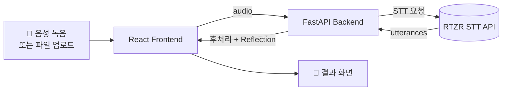
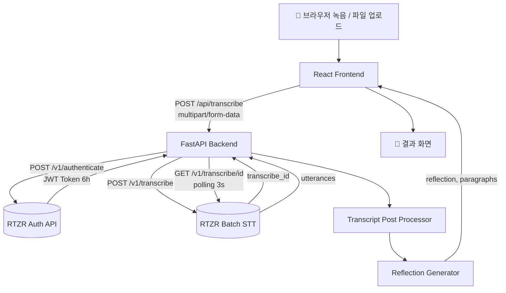
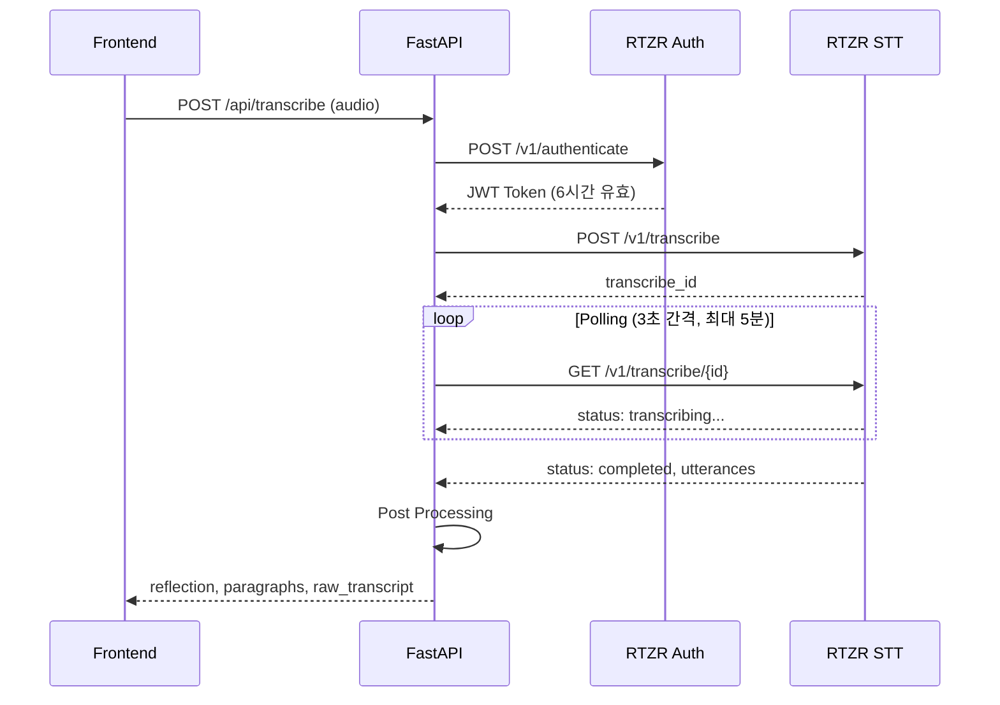
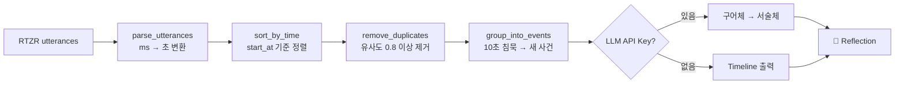

# EchoLog

> **Speak naturally. Reflect clearly.**

하루를 친구에게 이야기하듯 말하면, RTZR STT API로 전사하고  
후처리 파이프라인을 통해 읽기 좋은 **회고(Reflection)** 로 재구성해주는 웹 앱입니다.

---

## 프로젝트 소개

음성 메모는 자연스럽지만 다시 읽기 어렵고, STT 결과는 구어체라 그대로 쓰기엔 불편합니다.  
EchoLog는 이 문제를 **후처리 파이프라인**으로 해결합니다.

- 🎤 말하기만 하면 텍스트로 전사
- ✂️ 추임새 제거 · 중복 정리 · 사건 단위 그룹핑
- 📝 읽기 좋은 Reflection으로 재구성

---

## 구조 한눈에 보기



---

## 사용 방법

1. **🎤 녹음 시작** — 마이크 권한 허용 후 하루를 편하게 말하기
2. **⏹ 녹음 완료** — 자동으로 WAV 인코딩 후 백엔드로 전송
3. **결과 확인** — Reflection 텍스트 확인
4. **원본 전사 보기** (선택) — RTZR STT 원본 + 사건별 타임라인 확인

> 음성 파일 직접 업로드(wav, mp3, m4a 등)도 지원합니다.

---

## 시작하기

### 사전 준비

- Python 3.11+
- Node.js 18+
- [RTZR 개발자 계정](https://developers.rtzr.ai/) 및 API 키

### 1. 저장소 클론

```bash
git clone https://github.com/eoog333/EchoLog.git
cd EchoLog
```

### 2. 백엔드

```bash
cd backend
python -m venv .venv
source .venv/bin/activate      # Windows: .venv\Scripts\activate
pip install -r requirements.txt
cp .env.example .env           # .env 파일에 API 키 입력
uvicorn app.main:app --reload
```

→ `http://localhost:8000/docs` 에서 Swagger UI 확인

### 3. 프론트엔드

새 터미널을 열고:

```bash
cd frontend
npm install
npm run dev
```

→ `http://localhost:5173` 에서 앱 확인

### 환경변수 (.env)

```env
RTZR_CLIENT_ID=your_client_id
RTZR_CLIENT_SECRET=your_client_secret
LLM_API_KEY=          # 선택 — 비워두면 Timeline 모드로 동작
```

---

## 기술 스택

| 레이어 | 기술 | 비고 |
|--------|------|------|
| Frontend | React 19 + Vite | 상태 기반 단일 페이지 |
| 스타일 | Vanilla CSS | 별도 UI 라이브러리 없음 |
| 오디오 | Web Audio API | WAV 직접 인코딩 (브라우저 호환성) |
| Backend | FastAPI (Python) | Swagger 자동 문서화 |
| 환경변수 | pydantic-settings | 타입 안전한 `.env` 로드 |
| STT | RTZR Batch STT API | 추임새 제거, 문단 분리 |

---

## 상세 아키텍처



### RTZR API 시퀀스



---

## 후처리 파이프라인



| 기능 | 설정값 | 목적 |
|------|--------|------|
| `use_disfluency_filter` | `true` | 추임새(어, 음, 그) 제거 |
| `use_paragraph_splitter` | `true` | 의미 단위 문단 분리 |
| `use_itn` | `true` | 숫자/단위 표기 변환 |

---

## 프로젝트 구조

```
EchoLog/
├── backend/
│   ├── app/
│   │   ├── main.py                      # FastAPI 앱, CORS 설정
│   │   ├── config.py                    # 환경변수 로드
│   │   ├── routers/transcribe.py        # POST /api/transcribe
│   │   └── services/
│   │       ├── rtzr_client.py           # RTZR API 클라이언트
│   │       ├── transcript_processor.py  # 후처리 파이프라인 ⭐
│   │       └── reflection_generator.py  # Reflection 생성
│   ├── tests/
│   └── README.md
│
├── frontend/
│   ├── src/
│   │   ├── App.jsx                      # 상태 기반 단일 페이지
│   │   ├── hooks/useAudioRecorder.js    # 브라우저 녹음 + WAV 인코딩
│   │   └── services/api.js             # 백엔드 API 호출
│   └── README.md
│
└── docs/
    └── EchoLog_기획_구현.md
```

---

## 상세 문서

- [Backend README](./backend/README.md) — 모듈 설계, API 스펙, 테스트
- [Frontend README](./frontend/README.md) — Web Audio API, 상태 관리

---

## 테스트

```bash
cd backend
pytest tests/ -v
```