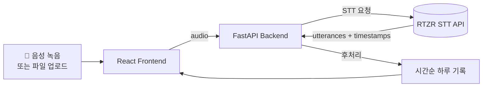
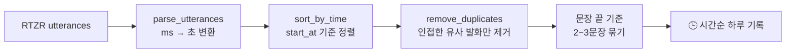

# EchoLog Demo

> **Speak naturally. Reflect clearly.**

🌐 **[프로젝트 소개 페이지](https://eoog333.github.io/EchoLog-Demo/)**

하루를 친구에게 이야기하듯 말하면, RTZR STT API로 전사하고
읽기 쉬운 **시간순 하루 기록**으로 정리해 주는 웹 앱입니다.

---

## 프로젝트 소개

음성 메모는 자연스럽지만 다시 읽기 어렵고, STT 결과는 구어체라 그대로 보기 불편합니다.
EchoLog는 RTZR STT의 전처리 기능과 가벼운 후처리를 결합해, 말한 순서를 보존한 채 다시 읽을 수 있는 하루 기록을 제공합니다.

- 🎤 말하기만 하면 텍스트로 전사
- ✂️ 추임새 제거 · 숫자 표기 정리 · 인접 중복 정리
- 🕒 실제 녹음 시각 순서로 문장을 묶은 하루 흐름
- 📝 필요할 때 원본 전사문 확인

---

## 사용 방법

1. **🎤 녹음 시작** — 마이크 권한을 허용하고 하루를 편하게 말합니다.
2. **⏹ 녹음 완료** — 음성 파일을 백엔드로 전송합니다.
3. **오늘 하루 흐름 확인** — 실제 녹음 시각 순서로 정리된 기록을 읽습니다.
4. **원본 전사 보기** (선택) — 전사문을 비교·확인합니다.

`오늘의 주제`에는 서비스명이나 고유명사처럼 정확히 인식하고 싶은 단어를 선택적으로 입력할 수 있습니다.

> ⚠️ **참고**: 본 애플리케이션은 기능 검증을 위한 데모 버전으로, 데이터베이스를 통한 기록 저장 및 파일 영구 보존 기능은 제공하지 않습니다. (새로고침 시 데이터가 초기화됩니다.)

음성 파일 직접 업로드(wav, mp3, m4a 등)도 지원합니다.

---

## 시작하기

### 사전 준비

- Python 3.11+
- Node.js 20.19+ 또는 22.12+
- [RTZR 개발자 계정](https://developers.rtzr.ai/) 및 API 키

### 1. 저장소 클론

```bash
git clone https://github.com/eoog333/EchoLog-Demo.git
cd EchoLog-Demo
```

### 2. 백엔드 서버 실행 (터미널 1)

> 💡 **가상환경 권장**: 로컬 개발 환경의 글로벌 패키지 버전 충돌 방지 및 안전한 의존성 격리를 위해 파이썬 가상환경(venv)을 활성화하여 구동할 것을 강력히 권장합니다.

먼저 백엔드 폴더로 이동하여 가상환경을 세팅합니다. 사용하시는 OS에 맞는 명령어를 입력해 주세요.

**🍎 Mac / Linux 사용자**

```bash
cd backend
python3 -m venv .venv
source .venv/bin/activate
pip install -r requirements.txt
cp .env.example .env
# .env 파일을 열어 발급받은 RTZR API 키를 입력하세요.
uvicorn app.main:app --reload
```

**🪟 Windows 사용자**

```bash
cd backend
python -m venv .venv
.venv\Scripts\activate
pip install -r requirements.txt
copy .env.example .env
# .env 파일을 열어 발급받은 RTZR API 키를 입력하세요.
uvicorn app.main:app --reload
```

서버 실행 후 `http://localhost:8000/docs`에서 Swagger UI 접속이 가능합니다.

### 3. 프론트엔드 실행 (터미널 2)

> **주의:** 백엔드가 실행된 상태를 유지해야 하므로, **반드시 새로운 터미널을 하나 더 열어주세요!**

```bash
cd frontend
npm install
npm run dev
```

### 준비 완료

모든 설정이 끝났습니다. `npm run dev`를 실행하면 자동으로 브라우저 창이 열립니다. 이제 마이크를 켜고, 친구에게 이야기하듯 오늘 하루를 기록해 보세요.

- **웹 화면 접속:** [http://localhost:5173](http://localhost:5173)
- **API 명세 (Swagger):** [http://localhost:8000/docs](http://localhost:8000/docs)
### 환경변수 (`.env`)

```env
RTZR_CLIENT_ID=your_client_id
RTZR_CLIENT_SECRET=your_client_secret
LLM_API_KEY=          # 향후 LLM 연동 확장용 — 현재 미사용
```

---

## 구조 한눈에 보기



---

## 기술 스택

| 레이어 | 기술 | 비고 |
|---|---|---|
| Frontend | React 19 + Vite | 상태 기반 단일 페이지 |
| 스타일 | Vanilla CSS | 별도 UI 라이브러리 없음 |
| 오디오 | Web Audio API | 브라우저 녹음 및 파일 업로드 |
| Backend | FastAPI (Python) | Swagger 자동 문서화 |
| 환경변수 | pydantic-settings | 타입 안전한 `.env` 로드 |
| STT | RTZR Batch STT API | 전사·전처리·시각 정보 |

---

## RTZR API 활용

| 기능 | 설정 | EchoLog에서의 역할 |
|---|---|---|
| Batch STT + Polling | `/v1/transcribe` 요청 후 상태 조회 | 음성 파일을 비동기로 전사 |
| 간투어 필터 | `use_disfluency_filter: true` | `어`, `음` 같은 불필요한 표현 감소 |
| ITN | `use_itn: true` | 숫자·단위·약어를 읽기 쉬운 표기로 변환 |
| 문단 나누기 | `use_paragraph_splitter: true` | 후처리에 쓸 짧은 전사 단위 생성 |
| 단어별 Timestamp | `use_word_timestamp: true` | 시간 표현이 나온 실제 발화 시각 확인 |
| 키워드 부스팅 | `keywords` | 사용자가 입력한 주제·고유명사의 인식 보조 |

---

## 후처리 파이프라인



후처리 원칙은 단순하게 유지합니다.

- 발화 순서와 사실은 바꾸지 않습니다.
- 문단은 문장 끝에서만 나눕니다.
- `아침`, `점심`, `저녁` 같은 시간 표현은 문장 맨 앞에 있을 때만 문단 분리의 보조 힌트로 사용합니다.
- 화면에는 `00:00` 형식의 실제 녹음 시각을 일관되게 표시합니다.
- 자연스러운 요약·문장 재서술은 향후 LLM 연동으로 확장합니다.

---

## 프로젝트 구조

```text
EchoLog/
├── backend/
│   ├── app/
│   │   ├── main.py                      # FastAPI 앱, CORS 설정
│   │   ├── config.py                    # 환경변수 로드
│   │   ├── routers/transcribe.py        # POST /api/transcribe
│   │   └── services/
│   │       ├── rtzr_client.py           # RTZR API 클라이언트
│   │       ├── transcript_processor.py  # 시간순 기록 후처리
│   │       └── reflection_generator.py  # 향후 요약 확장 지점
│   ├── tests/
│   └── README.md
├── frontend/
│   ├── src/
│   │   ├── App.jsx                      # 상태 기반 단일 페이지
│   │   ├── hooks/useAudioRecorder.js    # 브라우저 녹음
│   │   └── services/api.js              # 백엔드 API 호출
│   └── README.md
└── docs/
    └── EchoLog_기획_구현.md
```

---

## 상세 문서

- [Backend README](./backend/README.md) — 모듈 설계, API 스펙, 테스트
- [Frontend README](./frontend/README.md) — 녹음·상태 관리·화면 구성
- [초기 기획 문서](./docs/EchoLog_기획_구현.md)

---

## 테스트

```bash
cd backend
source .venv/bin/activate
pytest tests/ -v

cd ../frontend
npm run build
```

## 참고

- [RTZR Batch STT](https://developers.rtzr.ai/docs/stt-file/)
- [RTZR 문단 나누기](https://developers.rtzr.ai/docs/stt-file/paragraph-splitter/)
- [RTZR 단어별 Timestamp](https://developers.rtzr.ai/docs/stt-file/word_timestamp/)
