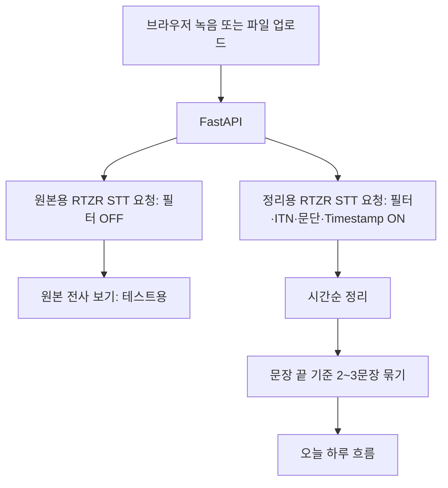

# EchoLog

> Speak naturally. Keep the day in order.

EchoLog는 하루를 편하게 말하면 RTZR STT API로 전사하고, 실제 발화 시각 순서에 따라 다시 읽기 쉬운 기록으로 보여주는 웹 앱입니다.

## 무엇을 보여주나

- **오늘 하루 요약**: LLM 또는 Enterprise Insight 연동을 위한 UI 영역입니다. 현재는 준비 상태입니다.
- **오늘 하루 흐름**: 실제 녹음 시각(`00:00`) 순서대로 정리한 2~3문장 단위 기록입니다.
- **원본 전사 보기**: 기능 적용 전후를 비교하기 위한 필터 전 전사문입니다. 현재는 테스트·검증용이며 최종 서비스에서는 제거 예정입니다.

## RTZR API 활용

| 기능 | 사용 방식 | 결과에 주는 역할 |
|---|---|---|
| Batch STT + Polling | 음성 파일 전사 작업 생성 후 완료까지 조회 | 모든 기록의 기반 전사문 생성 |
| 간투어 필터 | 정리용 요청에서 활성화 | `어`, `음` 등 불필요한 구어체 감소 |
| ITN | 정리용 요청에서 활성화 | 숫자·단위·약어를 읽기 좋은 표기로 정리 |
| 문단 나누기 | 정리용 요청에서 `max: 50`으로 활성화 | 시간순 기록을 만들 짧은 분석 단위 생성 |
| 단어별 Timestamp | 정리용 요청에서 활성화 | 문장 맨 앞 시간 표현이 실제로 말해진 시각 확인 |
| 키워드 부스팅 | 사용자가 입력한 `오늘의 주제`를 전달 | 서비스명·고유명사 등 전사 정확도 보조 |

RTZR의 문단 나누기 결과를 그대로 화면에 출력하지는 않습니다. 지나치게 짧게 끊기는 문제를 막기 위해, 앱이 문장 끝 기준으로 다시 2~3문장씩 묶어 보여줍니다.

## 처리 흐름



시간순 정리 규칙은 의도적으로 작게 유지합니다.

1. RTZR의 `start_at` 순서를 보존합니다.
2. `.`·`?`·`!` 뒤에서만 문단을 나눕니다.
3. 문단은 2~3문장으로 묶고, 마지막 한 문장 조각은 앞 문단에 붙입니다.
4. `아침`, `점심`, `저녁` 같은 시간 표현은 **문장 맨 앞**에 있을 때만 분리 힌트로 사용합니다.
5. 화면에는 시간대 단어 대신 실제 녹음 시각을 일관되게 표시합니다.

문장 순서를 바꾸거나 문법을 고치는 작업은 하지 않습니다. 이는 추후 LLM 요약·정리 단계의 역할입니다.

## 실행 방법

### 1. 백엔드

```bash
cd backend
python -m venv .venv
source .venv/bin/activate
pip install -r requirements.txt
cp .env.example .env
uvicorn app.main:app --reload
```

`.env`에는 아래 값을 설정합니다.

```env
RTZR_CLIENT_ID=your_client_id
RTZR_CLIENT_SECRET=your_client_secret
LLM_API_KEY= # 현재 미사용
```

백엔드는 `http://localhost:8000`, API 문서는 `http://localhost:8000/docs`에서 확인할 수 있습니다.

### 2. 프론트엔드

새 터미널에서 실행합니다.

```bash
cd frontend
npm install
npm run dev
```

`http://localhost:5173`에서 앱을 열 수 있습니다.

## 검증

```bash
cd backend
source .venv/bin/activate
pytest tests/ -v

cd ../frontend
npm run build
```

## 문서

- [백엔드 구현 상세](./backend/README.md)
- [프론트엔드 구현 상세](./frontend/README.md)
- [초기 기획 문서](./docs/EchoLog_기획_구현.md)

## 참고

- [RTZR Batch STT](https://developers.rtzr.ai/docs/stt-file/)
- [RTZR 문단 나누기](https://developers.rtzr.ai/docs/stt-file/paragraph-splitter/)
- [RTZR 단어별 Timestamp](https://developers.rtzr.ai/docs/stt-file/word_timestamp/)
